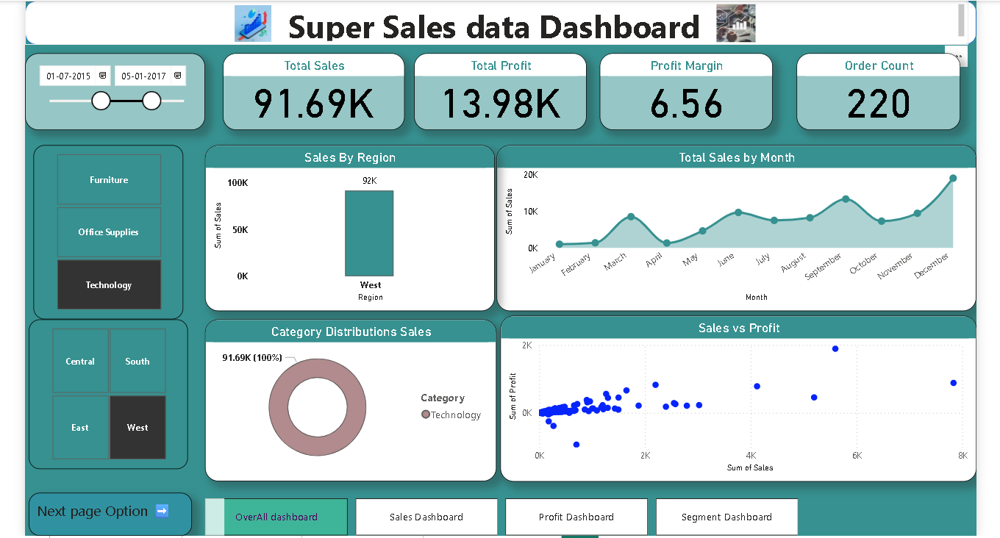
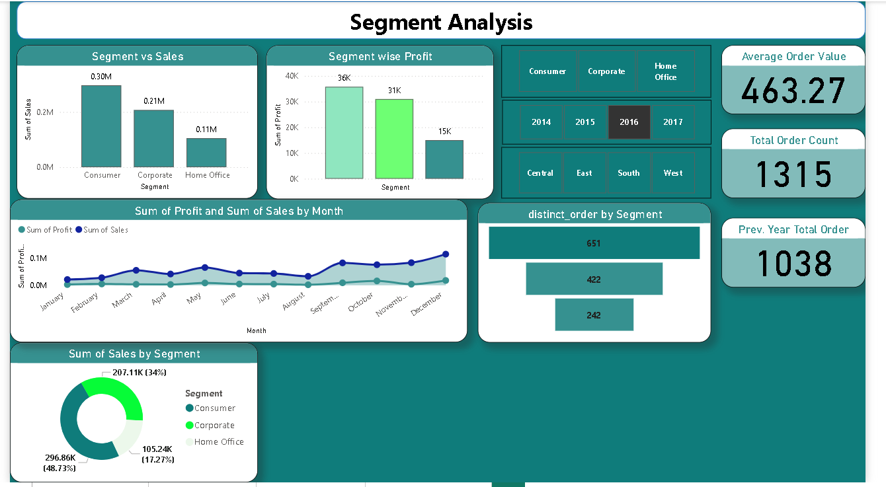
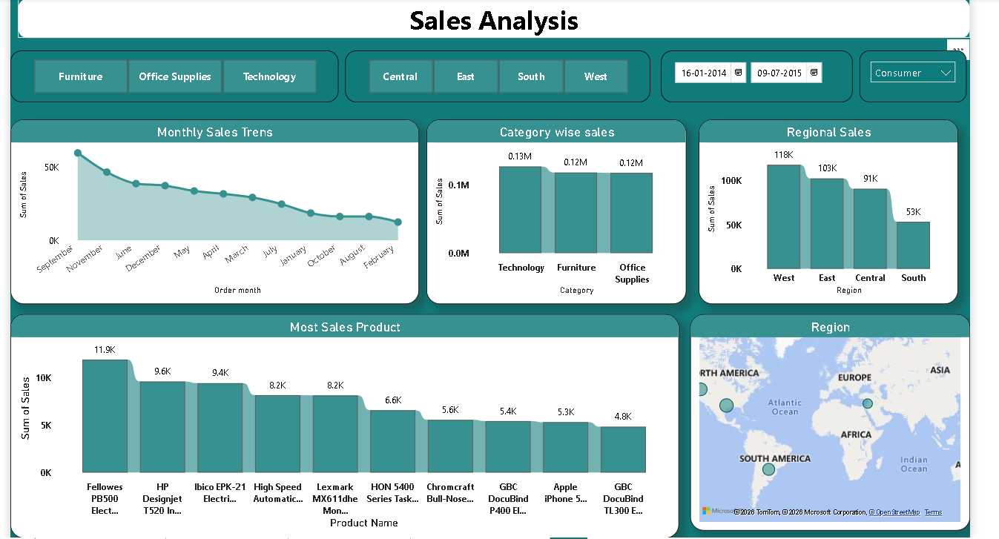
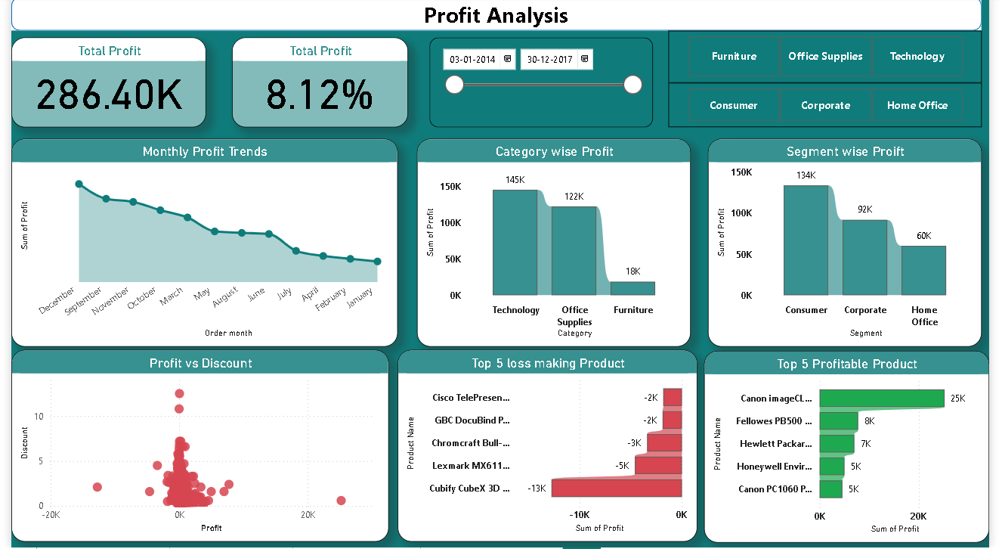

# 🛒 Super Store Sales Analysis & Interactive Dashboard

##  Project Overview

This project focuses on analyzing Super Store sales data to uncover meaningful business insights and identify opportunities for improving sales performance and profitability.

The analysis was performed using Python, followed by the creation of an interactive dashboard to visualize key business metrics.

---

##  Objectives

* Analyze overall sales performance.
* Identify profitable and loss-making segments.
* Understand customer segment behavior.
* Discover sales and profit trends.
* Build an interactive dashboard for business decision-making.

---

##  Tools & Technologies

* Python
* Jupyter Notebook
* Pandas
* NumPy
* Matplotlib
* Seaborn
* Power BI (Dashboard)

---

##  Dataset

The dataset contains historical Super Store sales transactions, including:

* Order Date
* Customer Segment
* Region
* Category & Sub-Category
* Sales
* Profit
* Quantity
* Discount

---

##  Project Structure

```
Super-Sales-Analysis/
│
├── Data/
│   └── Superstore_data.csv
│
├── notebooks/
│   └── super_market_data_analysis.ipynb
│
├── dashboard/
├   ├── super_sales_data.pbix
│   ├── overall_sales_dashboard.png
│   ├── segment_dashboard.png
│   ├── sales_dashboard.png
│   └── profit_dashboard.png
│
├── README.md
└── requirements.txt


```

---

## Installation

1) git clone <repository-url>

2) cd Sales-Data-Analysis-main

3) pip install -r requirements.txt 

4) jupyter notebook

---

##  Analysis Performed

### Data Understanding

* Dataset exploration
* Shape and structure analysis
* Data types inspection
* Summary statistics
* Random sampling

### Exploratory Data Analysis (EDA)

* Sales distribution analysis
* Profit analysis
* Category and sub-category analysis
* Customer segment analysis
* Regional performance analysis
* Correlation analysis
* Business trend visualization

---

##  Dashboard Pages

### 1️⃣ Overall Sales Dashboard

Provides a complete overview of:

* Total Sales
* Total Profit
* Total Orders
* Key Performance Indicators (KPIs)

---

### 2️⃣ Segment Dashboard

Analyzes performance across customer segments:

* Consumer
* Corporate
* Home Office

---

### 3️⃣ Sales Dashboard

Highlights:

* Sales trends
* Regional sales performance
* Category-wise sales insights

---

### 4️ Profit Dashboard

Focuses on:

* Profit trends
* High-profit and low-profit areas
* Profit contribution analysis

---

##  Dashboard Preview

### Overall Sales Dashboard



### Segment Dashboard



### Sales Dashboard



### Profit Dashboard



---

##  Key Features

* Data Cleaning & Preprocessing
* Exploratory Data Analysis (EDA)
* Sales & Profit Analysis
* Customer Segment Analysis
* Interactive Power BI Dashboard
* Business Insight Generation

---

##  Key Insights

* Identified top-performing customer segments.
* Analyzed categories contributing most to revenue.
* Detected areas with lower profitability.
* Created interactive dashboards to support data-driven decision-making.

---

##  Future Improvements

* Sales forecasting using Machine Learning.
* Customer segmentation using clustering techniques.

---

## 👨‍💻 Author

**Apoorva Gupta**

Aspiring Data Analyst / Business Analyst

If you found this project interesting, feel free to connect and explore more of my work.
